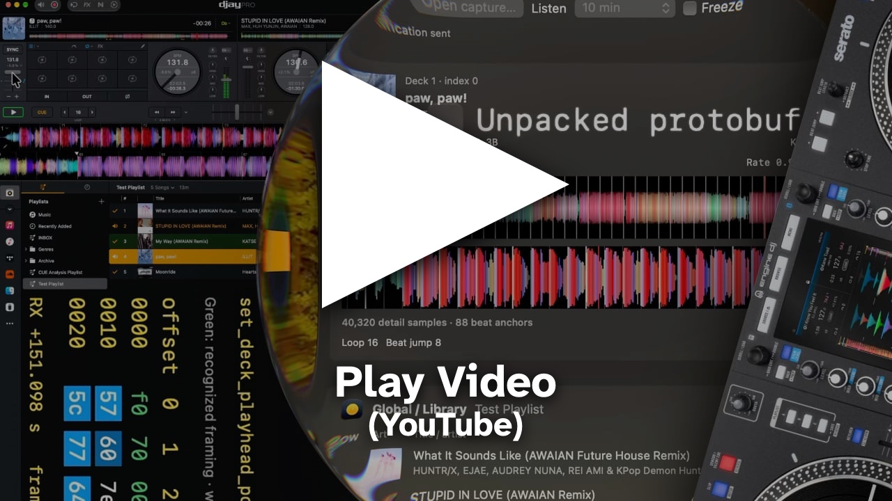

# djay Pro Bridge — RANE SYSTEM ONE proof of concept

A macOS debugger that receives djay Pro’s RANE SYSTEM ONE controller data through MIDI SysEx: track metadata, playhead updates, waveforms, beat grids, cues, loops, artwork and library rows. No controller hardware is required for the tested setup.

[](https://www.youtube.com/watch?v=3iI3Lo5fUzo)

Looking for the Accessibility API reader? See [djay Pro Bridge on the main branch](https://github.com/kyleawayan/djay-pro-bridge/tree/main).

**Experimental: tested only with djay Pro 5.6.9 on macOS. Future updates may require code changes; compatibility is not guaranteed.**

## Before running

Requires macOS 13+, Swift 6.2+ through Xcode or its Command Line Tools, and an installed djay Pro app for full decoding. Swift Package Manager resolves the SwiftProtobuf dependency on the first build.

**The debugger reads the installed djay executable on your Mac** to locate its embedded protobuf schema. It does not modify djay. No schema export or Swift type generation is needed to build or run the debugger.

**Connecting can unload decks and change audio routing.** Connect before loading tracks. Disconnecting does not restore the previous djay state.

## Run the debugger

1. Check out this branch:
   ```sh
   git switch poc/system-one-telemetry
   ```
2. Start djay Pro and run:
   ```sh
   swift run SystemOneInspector
   ```
3. Press **Connect**, then load and play tracks in djay.

All decks and Global/Library appear on one screen. Expand **Raw packets and every decoded field** to inspect message families, bytes and values. **Freeze** pauses display updates while recording continues; **Open capture…** loads a saved capture offline.

Waveform gaps mean samples have not arrived for that region. Library rows reflect received data, not a complete library export. Initial image-cache entries may be generic icons rather than track artwork.

## How it works

The debugger creates a temporary pair of SYSTEM ONE MIDI endpoints. After djay identifies itself, it sends one peer-identification keepalive to start the metadata stream. Incoming SysEx fragments are reassembled and unpacked into protobuf messages; the locally loaded schema supplies field names and types.

Overview waveforms are images. Detailed waveforms are RGB/height display samples, not audio. The UI updates on incoming data, with bursts combined into one redraw. The debugger sends no playback or browsing commands.

Schema discovery searches for a recognizable descriptor rather than a fixed byte offset. Changes to the descriptor, connection exchange or field meanings may require code updates. If schema loading fails, limited numeric decoding remains available. Mobile compatibility is unverified.

## Optional protobuf export

To export the schema from your installed djay app:

```sh
python3 scripts/research/extract_system_one_proto.py '/Applications/djay Pro.app'
```

The command prints a new temporary directory containing the descriptor, descriptor set, reconstructed `.proto` and extraction metadata. Add `--swift` to generate Swift types with already-installed `protoc` and `protoc-gen-swift`. This step is optional; the debugger reads its schema directly from djay.

## CLI capture and image export

Capture an initialized stream while djay is running:

```sh
swift run SystemOneProbe --identity system-one-display \
  --accept-deck-changes --startup-keepalive --seconds 120
```

The probe prints its capture directory. After capture, export received images and waveform contact sheets:

```sh
swift run SystemOneCapture /path/to/capture/traffic.ndjson
```

Captures can contain library listings and artwork; keep them local. See [CLI options](docs/research/system-one-cli.md), [the debugger guide](docs/research/system-one-inspector.md), and [the protocol overview](docs/research/system-one-protocol.md).

## Tests

```sh
swift test --filter 'SystemOne.*Tests'
python3 -m unittest discover -s scripts/research -p 'test_*.py'
```

## Community discussion

[Original Algoriddim Community discussion: a ShowKontrol-like deck monitor for djay on macOS](https://community.algoriddim.com/t/created-a-showkontrol-like-deck-monitoring-tool-for-djay-on-macos/41823)

## Credits

The packet debugger’s hex grid and fading byte-change highlights are inspired by [Dysentery by Deep Symmetry](https://github.com/Deep-Symmetry/dysentery), particularly its [Packet Window](https://github.com/Deep-Symmetry/dysentery/blob/main/doc/assets/PacketWindow.png). No Dysentery source code or screenshot assets are included.

Descriptor parsing uses [SwiftProtobuf](https://github.com/apple/swift-protobuf). Optional Swift type generation uses [Protocol Buffers](https://github.com/protocolbuffers/protobuf) and SwiftProtobuf’s Swift generator.

## License

MIT

## Record telemetry sessions

1. Open the inspector and connect before loading tracks.
2. Choose **Recording Folder…** once. The app remembers that folder in macOS preferences.
3. Press **Start Recording**. Press **Stop Recording** to finish without disconnecting.

Sessions contain `session.json`, readable `events.ndjson`, and deduplicated assets. Live listening continues until disconnected. CLI probes also run until Ctrl-C unless a positive `--seconds` is provided. Pending-work queues remain bounded; dropped data and disk failures are reported. Library and deck artwork retain the image assigned to them when reusable cache slots change.

A `deck-artwork` event with `asset: null` clears a previously recorded cover. `created_at` remains the recording start time when the manifest is finalized. Terminal transport loss marks the session incomplete even when no later message arrives.
